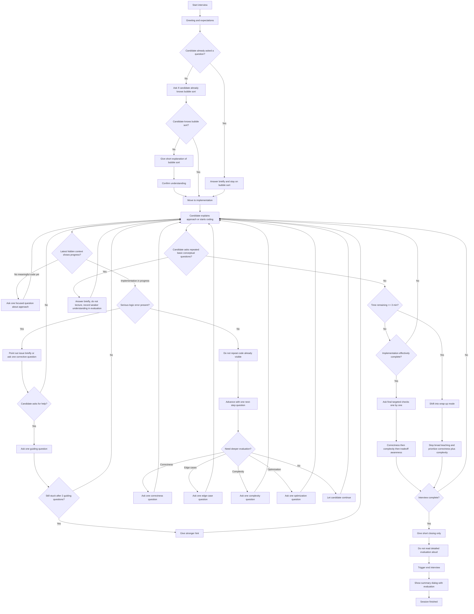

- a mock coding interview coach
- be able to "interrupt" user when the waiting time or the context is too long

```mermaid
flowchart TD
    A[Start interview] --> B[Greeting and expectations]
    B --> C{Candidate already asked a question?}
    C -->|Yes| F[Answer briefly and stay on bubble sort]
    C -->|No| D[Ask if candidate already knows bubble sort]

    D --> E{Candidate knows bubble sort?}
    E -->|No| G[Give short explanation of bubble sort]
    G --> H[Confirm understanding]
    H --> I[Move to implementation]
    E -->|Yes| I
    F --> I

    I --> J[Candidate explains approach or starts coding]
    J --> K{Latest hidden context shows progress?}

    K -->|No meaningful code yet| L[Ask one focused question about approach]
    L --> J

    K -->|Implementation in progress| M{Serious logic error present?}
    M -->|Yes| N[Point out issue briefly or ask one corrective question]
    N --> O{Candidate asks for help?}
    O -->|Yes| P[Ask one guiding question]
    P --> Q{Still stuck after 2 guiding questions?}
    Q -->|Yes| R[Give stronger hint]
    Q -->|No| J
    R --> J
    O -->|No| J

    M -->|No| S[Do not repeat code already visible]
    S --> T[Advance with one next-step question]
    T --> U{Need deeper evaluation?}
    U -->|Correctness| V[Ask one correctness question]
    U -->|Edge cases| W[Ask one edge-case question]
    U -->|Complexity| X[Ask one complexity question]
    U -->|Optimization| Y[Ask one optimization question]
    U -->|No| Z[Let candidate continue]
    V --> J
    W --> J
    X --> J
    Y --> J
    Z --> J

    J --> AA{Candidate asks repeated basic conceptual questions?}
    AA -->|Yes| AB[Answer briefly, do not lecture, record weaker understanding in evaluation]
    AB --> J
    AA -->|No| AC{Time remaining <= 3 min?}

    AC -->|No| AD{Implementation effectively complete?}
    AD -->|No| J
    AD -->|Yes| AE[Ask final targeted checks one by one]
    AE --> AF[Correctness then complexity then tradeoff awareness]
    AF --> AG{Interview complete?}

    AC -->|Yes| AH[Shift into wrap-up mode]
    AH --> AI[Stop broad teaching and prioritize correctness plus complexity]
    AI --> AG

    AG -->|No| J
    AG -->|Yes| AJ[Give short closing only]
    AJ --> AK[Do not read detailed evaluation aloud]
    AK --> AL[Trigger end interview]
    AL --> AM[Show summary dialog with evaluation]
    AM --> AN[Session finished]
```